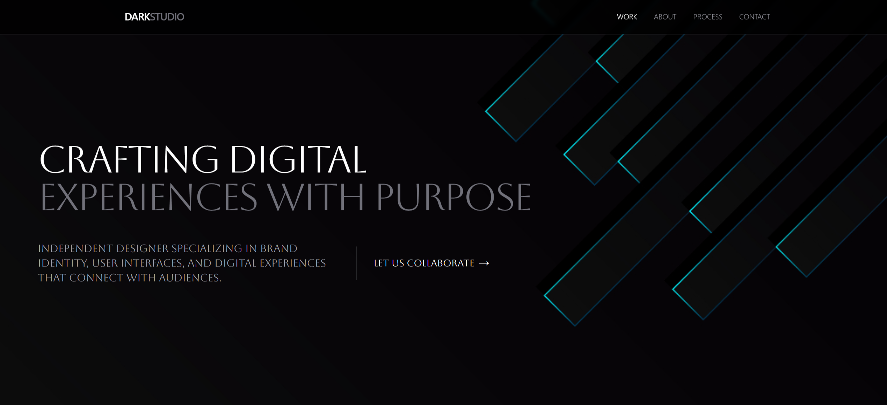

# Dark JS Starter Template

<p align="center">
  
</p>

This is a [DarkJS](https://darkjs.com/) developed with
[Next.js](https://nextjs.org/), [TailwindCSS](https://tailwindcss.com/) and
[ShadCN](https://ui.shadcn.com).

## Getting Started

First, run the development server:
```bash
npm install
# or
yarn

```bash
npm run dev
# or
yarn dev
# or
pnpm dev
# or
bun dev
```

Open [http://localhost:3000](http://localhost:3000) in your browser to see the result.
